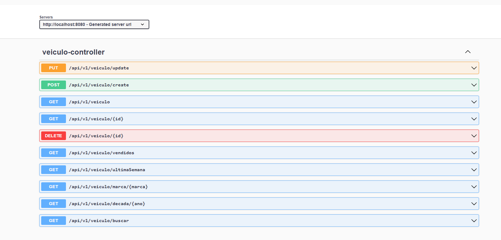

# Cadastro de Veículos

...

## Acesso à Documentação Swagger

A documentação da API pode ser encontrada no Swagger UI. Você pode acessá-la através do seguinte link:

[Swagger UI - Documentação da API](http://localhost:8080/swagger-ui/index.html#/)

Esta documentação fornece uma visão detalhada dos endpoints disponíveis, seus parâmetros e exemplos de requisições.

## Tecnologias Utilizadas

- Java
- Spring Boot
- Spring Data JPA
- Spring MVC
- Thymeleaf (ou outra template engine de sua escolha)
- Banco de dados (por exemplo: MySQL, PostgreSQL, H2, etc.)

## Configurações

### Perfis

O projeto possui dois perfis de configuração: `dev` e `local`.

#### Perfil de Desenvolvimento (dev)

Para o perfil de desenvolvimento, utilize o banco de dados PostgreSQL:

# Execução com Docker
####  Este projeto possui um arquivo docker-compose.yml para facilitar a configuração do ambiente de desenvolvimento.

- Pré-requisitos
- Docker instalado no sistema.
- Passos
- Clone o repositório para sua máquina local:

git clone https://github.com/seu-usuario/cadastro-de-veiculo.git

- Navegue até o diretório do projeto:

cd cadastro-de-veiculo/docker

docker-compose up -d

 

